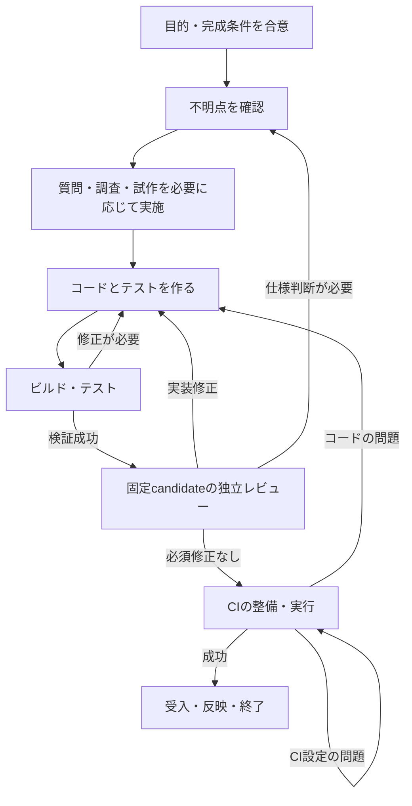

# 合意・成果物・検証・再開を中心にしたAI-DLCの設計案

- 日付: 2026-09-07
- 状態: **Proposed — 設計・運用の検討案。実装、CLI互換性変更、既存データ移行は未承認**
- 調査したGo実装: `fc8bd7ea633f0c1ad8cc605233572a6106b3b911`
- 比較対象: リポジトリ固定AI-DLC `2.6.123`。最新upstreamとの一致は主張しない。
- 方針と承認境界: [RAM](../ram/decisions/2026-09-07-artifact-centered-workflow-proposal.md)

## 1. 利用者が得る結果

利用者は「33工程の何番目か」を管理する代わりに、「何を作ると合意したか」「今の成果物は何を確認済みか」
「何が未解決で、続きは何か」を確認する。AIは質問、調査、試作、実装、テスト、レビューを必要に応じて
繰り返す。作業方法を切り替えるたびに、利用者やAIが工程の完了・巻戻しを記録する必要はない。

たとえば予約画面を試作し、利用者の意見で修正し、テストで不具合を見つけて再修正できる。
その途中で会話を閉じても、次のAIは合意した仕様、作業中のコード、未解決事項から続きを進められる。
以前のコードで成功したテストを、修正後のコードの合格根拠として流用しない。

Stage名は「いま実装中」「いま検証中」という案内として残せる。Stageの順番や通過数は、操作の許可、
品質の合格、完成の根拠にしない。既存のStage原稿は、必要な作業を行うための手引きとして再利用を検討する。

## 2. 設計の原則

1. **小さな目的ごとにIntentを持つ。** Intentは、1つの目的と完成条件を共有する作業単位。
   製品全体や1回のAI会話とは異なる。通常は1つの変更・PR、実験なら1つの疑問の解消を目安にする。
2. **成果物を作る順番は固定しない。** 試作が必要なら要件検討中にもコードを書く。
   同じ目的の修正は同じIntentで続け、別の価値や目的の追加は別Intentか明示的な合意変更にする。
3. **完成条件と根拠を結び付ける。** ファイルがあること、AIが完了と宣言したこと、工程を通ったことだけでは完成にしない。
4. **既存の正本を複製しない。** コードの履歴はGit、PR・CIはGitHub、文書本文は文書に置く。
5. **保存は判断や引継ぎの節目に行う。** AIの全発言、全tool call、すべての失敗ログを新しい台帳へ複製しない。
6. **通常の修正は自律的に行い、重要な判断だけ確認する。** 既に許可された作業を再確認しない。
   目的、共有契約、追加権限、外部依存、公開・破壊的操作の権限は成果物の完成度と別に評価する。

## 3. 管理対象と正本

### 3.1 人に読める合意文書

Intentには、次の内容を短いMarkdownにまとめる。長い要件定義書を必須にはしない。

- 背景と目的、利用者に起きてほしい変化。
- 今回の範囲、重要な制約、完成条件。
- 成果物と、完成条件を確かめる方法。
- 既に許可された作業と、再確認が必要な判断。
- 必須の検証・レビュー・受入方法、および反映先。

合意は文書の特定の版へ結び付ける。文書を編集しただけで新しい版が承認済みになるわけではない。
変更案は作れるが、承認された目的・制約の置換は、対象を示したユーザーの回答か有効な包括承認を必要とする。
文書の軽微な整理と意味の変更をAIが推測して自動的に承認し直す機能は、初版では作らない。

「技術的に成立するか」を確かめる実験では、成立しないと根拠を示せたことも完成になり得る。
「仮説が成立した」と「実験を終えた」、「試作を終えた」と「本番利用可能」は同じ意味にしない。
この違いは完成条件に書き、別々の大きなworkflowを増やさない。

### 3.2 AI-DLCの最小作業記録

以下は論理モデルであり、JSON fieldやCLI文法の確定仕様ではない。

| 情報 | 最低限保持する内容 | 保持しない内容 |
| --- | --- | --- |
| 識別・保存版 | Workspace、Space、Intentの識別子、record schema version、更新番号 | cwdやbranch名だけに依存する同一性 |
| 合意 | 合意文書の版、適用する承認の参照・範囲、検証方針の版 | 会話全文、秘密情報、人間の作者性を証明したという主張 |
| 成果物 | 出力と参照入力、所有範囲、所在、特定の版 | コード・文書の本文の複製、全ファイルの巨大な依存graph |
| 検証 | 完成条件ごとの最新の根拠参照、対象の版、結果、実施方法・条件 | CI・レビューの全文複製、単なるpass boolean |
| 未解決事項 | 判断・調査・検証・修正が必要な理由、担当、次の方法 | 思いつきの無制限な改善リスト |
| 再開 | 直近の確定事実、次の具体的作業、外部処理の識別子、必要なら対象成果物の範囲 | AIの思考過程、コマンドを実行したはずという推測 |
| 終了 | 終了結果、完成条件の根拠、反映済みPR・commit等の参照 | Stageの完了数からの完成推測 |

recordの状態は原則`active`、`closed`、`cancelled`だけとする。`active`は実行中processの存在を意味しない。
「ユーザー回答待ち」「CI待ち」「中断」は、未解決事項・外部処理・checkpointから表示する。
`ready`は保存済みの恒久的な合格flagにせず、現在の対象と根拠を照合して導出する。
新しい修正に進む際も、実装・テスト・レビューごとのStage statusを網羅的に保存しない。

### 3.3 正本の分担

| 対象 | 正本 | AI-DLCの役割 |
| --- | --- | --- |
| 合意・仕様本文 | Gitで特定できる文書、または明示的に保存した不変の文書snapshot | どの版を採用したかを記録 |
| コード | repositoryとcommit。試作中はworktree | 作業対象と検証対象を取り違えない |
| CI・PR・merge | GitHub等の提供元 | repository、PR、実行ID、head/base、結果を照合 |
| ローカル検証 | 実行結果の小さなreportと必要なログ | 対象の版、command、終了結果、環境を結び付ける |
| 人・AIのレビュー | 保存したレビュー結果・外部review | 対象、reviewer、未解決の必須修正と処分を結び付ける |
| 未解決事項・checkpoint | Intentの作業record | 次回の引継ぎに必要な情報を保持 |
| 汎用knowledge | 既存Space knowledgeとOKFの正本 | 検索して使った資料を参照。知識の信頼度を操作の承認に読み替えない |

## 4. 成果物の版と検証の扱い

### 4.1 コードは実行対象の版に結び付ける

正式な検証・レビュー候補は、repository、base、head commitと検証方針を固定する。
実行はそのcandidateから用意した隔離checkout等、対象commitの内容と一致する環境で行い、結果取得まで
対象を変更しない。別のdirty worktreeで実行した結果にHEADの識別子だけを添えても正式な根拠として受理しない。
コードを修正したら、旧結果は履歴として残すが新candidateの合格には使わない。
CIは実行IDだけでなくrepository、対象head、workflowと結果を照合する。
baseが更新された場合は、PR／merge queue等が要求する統合後の検証条件も改めて確認する。
異なる環境・外部service・依存versionが結果に影響する検証は、その条件もreportへ含める。

未commitのコードでも自由に試せる。dirty worktreeでのテスト結果は修正中の参考情報にする。
初版は、それを正式な受入・mergeの根拠へ昇格させず、固定candidateで必要な検証を行う。
全repoの任意file集合を毎回snapshotしてdirty treeを証明する仕組みは作らない。

AI-DLCの作業record、取得ログ、検証reportは、検証対象コードのcommitを変更しない場所へ保存する。
記録を書いたためにHEADが変わり、記録のための再テストが永久に必要になる構成を避ける。
一方、製品に影響する規則、CI設定、依存設定は検証対象から外さない。

### 4.2 文書・画面・調査にも同じ区別を使う

- 文書の確認は、pathだけでなくcommit／不変versionと必要なcontent digestへ結び付ける。
- 画面の確認にはコードの版、表示条件、対象画面と操作、captureの参照を残す。
  screenshotがあるだけで利用者が確認済みとは扱わない。
- 調査は参照先と確認日、確定した内容と未確定事項を分ける。URLの存在だけで正しさを証明しない。
- 外部資料はmutableなURLを不変versionと扱わない。版がなければ確認時の根拠をreportへ残す。
  保存できない本文の複製、秘密情報、第三者の全文の無断保存を前提にしない。

### 4.3 根拠の結果と現在性を分ける

| 表示 | 意味 | 完成条件を満たせるか |
| --- | --- | --- |
| 成功・現在の対象と一致 | 必須検証が成功し、対象と条件が一致する | 該当する条件について可能 |
| 失敗 | 実行した検証が不合格 | 不可。原因に応じて修正する |
| 実行中・未実行 | 結果がまだない | 不可 |
| 古い対象の結果 | 過去には成功したが対象が変わった | 新しい対象の根拠には不可 |
| 確認不能 | network不通、ログ欠落、取消、対象不明、提供元の結果を確認できない | 必須条件について不可。成功や失敗へ推測変換しない |
| 該当なし | 合意した条件に照らして、その検証は不要 | 理由と方針への適合が確認できた場合だけ可能 |

AIの「テスト成功」という申告と、実行結果から取得した根拠を区別する。
既存のCI/native test出力を優先し、初版から専用の全tool監視hookは必須にしない。
根拠を取得するadapterはcommandや提供元の識別子・結果を読み取る。人手入力しかない結果は申告として表示し、
自動検証済みへ偽装しない。これは協調的なローカル開発の誤操作防止であり、同じ権限の悪意あるprocessに
対する暗号認証や改ざん不能性ではない。

## 5. 日常のworkflow



これは典型的な順序の案内であり、すべてのIntentに強制する状態遷移graphではない。
CIを先に用意すること、調査だけで実験を終えること、テストを先に失敗させて実装することを許す。
CI設定の修正がreview対象を変えれば、必要な検証・reviewも更新する。

初回は目的と完成条件を確認し、AIが不明点を分類する。利用者の意図なら質問、外部根拠なら調査、
資料から決まらない技術なら実験、使い勝手なら試作・操作確認を選ぶ。すべてを順番に実施しない。
次に、現在の目的の範囲で実装・テスト・修正を繰り返す。細かなRED/GREENのたびにCLIでStageを変更しない。
まとまった検証結果、目的の変更、明確な阻害要因、中断・引継ぎの時点でrecordを更新する。

必要な独立レビューを同じcandidateへ依頼し、実装修正が必要ならtest-firstで修正する。
レビュー結果は必須修正・先送り・対応不要に分ける。必須修正を、回数上限だけを理由に合格へ変更しない。
自律実行の時間・回数の予算に達したら、残る問題と試した方法をcheckpointに残して見直す。
その見直しが人の選択を必要とする場合だけ、影響を説明して質問する。

完成条件を満たした後は、許可済みの反映方法を使う。手動承認が必要なら成果物と不足のない根拠を提示する。
有効な包括承認がある場合は、通常修正やmergeごとに人の再承認を要求しない。
「検証に合格した」「反映する権限がある」「実際に反映された」は別々に確認する。

| 承認の種類 | 対象 | 修正したときの扱い |
| --- | --- | --- |
| 範囲への承認 | この目的・制約の中で実装し、指定条件で反映してよいという許可 | 範囲内のコード修正では維持。目的・権限・重要な契約が変われば再確認 |
| 特定成果物への承認 | この版の画面・仕様・リリース候補を採用してよいという確認 | 対象版が変わればその承認だけでは新しい版を許可しない |

どちらも対象と許可範囲が読める永続的な記録へ結び付ける。mutableな会話URLや「ユーザーが同意した」という
AIの要約だけでは、正規の承認操作を代用しない。具体的な取得・保存経路は既存の運用証拠境界内で別途確定する。

## 6. CLIとAIの責務

新しい経路は仮に`aidlc work ...`と呼ぶ。既存の`next`／`report --stage`の意味を無断で変更しない。
以下は操作の役割案であり、公開grammar・exit code・wireの確定ではない。

| 操作案 | 役割 | 副作用 |
| --- | --- | --- |
| `work start` | 目的・完成条件と既存資料から作業recordを作る | 明示対象にrecordを作成。承認を自動生成しない |
| `work status` | 合意、成果物、検証の現在性、未解決、次の候補を表示 | read-only。既定はlocal情報、外部情報の確認日時を表示 |
| `work next` | 再開用contextと、満たしていない条件を返す | read-only。工程移動・agent起動・外部操作はしない |
| `work checkpoint` | 確定事実、未解決、次の作業、根拠参照を更新 | 同一Intentの更新番号を確認して保存 |
| `work check` | 現在の対象と、必須の検証・承認・共有前提を照合する | 読取り。必要な外部readを明示し、実装やCIは勝手に起動しない |
| `work close` | 終了条件と反映結果を再確認して終了を記録する | local recordの終了だけ。merge/deploy自体は実行しない |

合意変更・回答・根拠取込み・取消・引継ぎは、別の構造化操作として明確に区別する必要があるが、
初版から多数のtop-level commandを増やさない。詳細CLI設計でcheckpointへの統合可否を決める。
自由文のcheckpointに「承認済み」と書いたことを、合意変更や終了承認の操作と扱わない。

CLIはファイル・commit・結果の一致や、必要な条件の欠落を検査する。問題の原因、適切な設計、
次にどの実験を行うべきかはAIと利用者が判断する。`next`が示す候補は許可ではなく、実行前に既存の権限を確認する。
契約不整合、旧根拠、未完了process、未解決必須事項は構造化して表示するが、CLIだけで意味的な完成を保証しない。

### 利用者への表示例

```text
作業: 予約画面で担当者を選べるようにする
合意: 仕様 第2版（採用済み）
成果物: reservation-ui / commit B

確認済み: commit Bの単体テスト
残っていること:
  - 独立レビューはcommit Aが対象。修正差分の確認が必要
  - commit BのCIは実行中
  - スマートフォンで担当者を選ぶ操作は未確認

次の候補: 修正差分をレビューし、画面の操作を確認する
人への確認: 現時点で追加の設計判断は不要
```

「現在Stage: 4/7」ではなく、利用者が進め方を判断できる不足と根拠を表示する。
例の「第2版」は説明用であり、実際の参照には不変version／commit等を使う。

## 7. 共有成果物の運用

### 7.1 所有範囲と参照範囲

- Intent所有: 今回の仕様変更、試作品、検証結果。作業担当が許可範囲内で編集する。
- Space共有: 同じ製品・業務の要件、業務ルール、共通API、設計方針。複数Intentが参照する。
- Workspace共有: 複数Spaceで共通に必要な開発・運用方針。明示的に登録された資料だけを参照する。

共有範囲は配布範囲であって、新しいアクセス権限の仕組みではない。元repositoryやserviceの権限を維持する。
初版では自動昇格、全文の一括複製、Workspace全体の知識の自動注入、全ファイルの自動依存解析を行わない。

### 7.2 正本・採用版・変更案を分ける

共有artifactは安定した識別子、所有するSpace／Workspace、管理者または承認方針、repositoryとpath、
採用版を識別できる参照を持つ。共有一覧は人に読める小さな文書としてGitで管理する案とする。
本文は既存の場所に置き、一覧へ複製しない。Git外の資料なら不変versionのあるservice参照か、明示snapshotを使う。

同じartifact IDが異なる正本を指したり、WorkspaceとSpaceに衝突した定義があったりした場合、
暗黙の優先順位で選ばず、今回のIntentがどちらを使うか明示する。
共有一覧の変更自体も普通の文書変更としてレビューし、独自の公開transactionを別に作らない。

Intentは共有正本を使うとき、その採用版を入力参照として固定する。調査で読んだだけの参考資料は別扱いにし、
すべてのreferenceが完成をblockしない。業務ルールやAPI等、成果物が満たすべき前提だけを必須入力に指定する。
本文を変更しただけでは共有の新しい採用版にならず、既定の管理者・方針による採用が必要となる。

### 7.3 共有文書を変更するとき

1. 現在の採用版を基点に、変更案と理由・影響を作る。正本を試作内容で上書きしない。
2. 合意済み範囲内なら既存の承認を使い、共有契約を変える場合は該当する管理者・ユーザーへ確認する。
3. GitのPR等、元の正本の通常の方法で変更を反映し、共有一覧の採用参照を更新する。
4. 各Intentの`status`／`check`は参照版の違いを検出し、必要な影響確認を表示する。

新しい採用版が出ても、進行中のIntentの入力を黙って最新へ差し替えない。
必須入力については、最新版へ合わせて再検証するか、従来版の継続使用を範囲・理由付きで許可するかを決める。
既存の仕様で継続使用が許可されていれば再承認は不要。そうでなければ、影響未確認のまま終了しない。
非影響と判断する場合も理由を残し、CLIが「同じ名称だから互換」と推測しない。

新しい版で影響する検証だけを見直す。初版のコード候補に対する正式検証は保守的に新candidateで行い、
任意のコード変更の影響範囲を自動証明して古い合格を再利用する機構は後段にする。

常駐監視は初版の前提にしない。変更の検出は再開・明示refresh・終了前に行う。
別cloneや別端末で新しい版が出ているかを確認できない場合は、その限界と最終確認時点を表示する。
外部の共有正本とmergeを全世界的に同時commitする保証は持たず、最終確認対象の版を終了記録へ残す。

## 8. 中断・失敗・並行作業

| 状況 | 運用 |
| --- | --- |
| 会話終了・context圧縮 | 直近のcheckpointと実ファイルを照合して再開。「次にする」は実行状態を証明しないため、再実行前にGit／CI／外部結果を照合する |
| AI・test processが突然終了 | 完了結果のない処理は不明。CIのrun ID等で確認できれば照会。できなければ再検証 |
| network不通・CI取得不能 | local作業は続行可能。外部確認が必須の反映・終了だけ止める |
| CIがpending／cancelled | 成功にしない。code failureとservice failureを分けて再実行先を判断 |
| 保存失敗 | 旧recordを維持し、成功を返さない。状態記録の失敗を、テスト自体の失敗と混ぜない |
| merge成功後、local更新に失敗 | PRの実状態を再読してlocalを追従。mergeを無条件で再送しない |
| stdoutが届かず結果不明 | recordの更新番号と操作IDを確認して保存結果を判定。応答欠落だけでrollbackしない |
| 同じIntentを2つのAIが変更 | writerは1つ。短時間のrecord lockと更新番号で競合を拒否し、古いcheckpointで上書きしない |
| 別Intentを並行実装 | 別worktreeを使い、対象branch／repositoryを明示。共有契約の変更は元repositoryの競合解決に従う |
| 別端末・cloneへ引継ぎ | 元のwriterを停止して明示export/import。新環境でrefs・未完process・CIを再照合してから継続 |
| record破損・不明なschema | 診断と利用可能なバックアップを提示。空のrecordへ初期化して完了履歴を消さない |

長いテストやAIレビュー中にrecord lockを保持しない。開始時の更新番号・対象版を覚え、結果取込み時に
再読する。対象が変わっていた結果は過去の検証として扱い、現在の合格を上書きしない。
同じworktreeを複数writerから安全に編集できるとlockで保証しない。初版は運用上の単独writerを前提にする。
既存lockの強制終了後のstale lockは自動で削除しない。owner/process確認を伴う復旧手順を別途実装する。

外部操作について、exactly-onceや分散transactionを主張しない。副作用の結果が不明なら提供元へ照会し、
照会できない破壊的操作は自動再試行しない。CI照会、local snapshot更新、読取り等は安全な再試行範囲を定める。

## 9. 保存とdurabilityの案

新workflowでは、既存Intent record内の専用JSON snapshotを、AI-DLCの**現在の作業情報の唯一の正本**とする案を推奨する。
仮称は`.aidlc-work.json`。schema version・更新番号・直近の操作IDを含める。
再試行IDは直近の保存結果を照合するためのもので、永久に全操作をdedupする台帳ではない。

更新はidentity-bound lock内でfresh readし、期待する更新番号を確認して、一時fileへの全byte write、close、
同じdirectory内のrenameで行う。終了判定に必要なrecord上の参照と終了状態は、1回のsnapshot更新にまとめる。
古い更新番号からは上書きしない。単一fileのatomic visibilityを保証対象とし、初版ではfsync・電源断耐性を追加保証しない。

文書・コード・CI結果は外側の正本にあるため、この保存をそれらと同時に成功させるtransactionにはしない。
参照先を先に作成・確認し、その参照をsnapshotへ保存する。参照保存に失敗しても元の成果物は残る。
`close`直前にcandidate・方針・必須根拠・反映結果を照合し、保存失敗時はlocal上は未終了として再試行する。
すべてを更新した後に「次Stage公開失敗」で部分完了する経路は持たない。`next`はその都度read-onlyに構成する。

### 既存auditとの関係

これは、旧Stage workflowのaudit-first二段階保存をそのまま拡張する案ではない。
旧auditと旧stateは変更せず保持する。新work recordでは、根拠・判断の本文を保存済みreport／文書に置き、
snapshotが採用する参照を持つ。別のaudit fileへの追記成功を、同じ操作の第二のcommit条件にしない。
診断や表示用に出力する履歴は、現在stateの権威と競合させない。

この案の代償として、snapshot単体からすべての過去操作を再生することはできない。
現在の判断の根拠と合意済みの版は保持するが、全操作の監査・改ざん検出が必要な用途は初版の保証に含めない。
新しいdurability・監査境界なので、採用には明示承認が必要である。

### バックアップと保持

作業recordはlocal runtime dataとして扱い、通常の製品commitへ自動で含めない。
受入に必要な文書・レビュー・検証reportは、消える一時ディレクトリだけに置かない。
終了時には目的、採用版、根拠への参照、未解決事項の処分をまとめた終了reportを永続的な文書／PRへ残す。
長期に根拠を必要とするCIログは提供元の保持期間を確認し、必要な要約・対象識別子を保存する。
保存したCI要約は過去の実行記録であり、現在のCIを再確認した証拠とは区別する。

引継ぎ用exportはsnapshotと必要なlocal reportを含み、秘密鍵・認証情報・不要なログを含めない。
外部の非公開URLや利用者情報が含まれ得るため、公開repositoryへ自動pushしない。
別環境へのimportではrepository identityと成果物を照合し、外部processの実行中状態を引き継いだと推測しない。
初版では自動削除・圧縮・cloud同期を必須にせず、既存バックアップにrecord/reportを含める運用を示す。

## 10. 過剰な管理を避ける境界

- Stageごとのattempt番号・通過履歴・承認票を、すべての作業へ要求しない。
- Git／CI／レビュー結果を別の巨大なevent storeへ複製しない。
- 作業recordと製品コードを同時commitするための分散transactionを作らない。
- 不明点をすべて解消するまで実装を禁止しない。実験で解消できる不明点は、その実験の完成条件にする。
- コマンド実行のたびのcheckpoint、毎回の全test、細かな作業ごとの人間承認を要求しない。
- 共有知識の自動依存graph、無制限な監視agent、AIの判断を保証するrisk scoring engineを初版へ追加しない。

## 11. 既存実装との関係と移行

### 再利用する候補

`workspace`のSpace／Intent識別、`recordlock`の排他、`state` writerのRoot confinement／atomic replacementの機械部分、
`audit`の運用証拠を扱う知見、`delivery`の安全な参照読込、`knowledge`／`okf`の検索を再利用候補にする。
単なるAPI呼出しで流用できるとは限らず、新しいidentity・wire・保存形式との整合を個別に検証する。
既存のhuman receiptは同じ利用者権限に対する認証済み著者証明ではない、という境界を維持する。

`orchestrator.ApproveGate`の「現在Stage完了から次Stageへの二段階保存」、`advance`の前方走査、
Stageの完了数に基づく終了、`run-stage`専用wireは、新経路の中心としては使用しない。
既存`next`／`report`を呼び替えるだけでこのworkflowが実装できたとは扱わない。

### 移行の推奨案

1. 読取り専用の既存Intent診断と、new workの設計契約を先に作る。
2. 新しいIntentでだけ新workflowを明示選択できるようにする。旧形式の動作を維持し、自動切替しない。
3. 既存Intentは明示的な移行操作で、旧state・audit・成果物を保存したまま新recordを作る。
   目的・承認・成果物・根拠・未解決事項を確認し、旧Stageの`[x]`を新しい受入条件の合格へ変換しない。
4. 同じIntentに新旧writerを同時に使わせない。旧readerでも拒否できるcutover guardか、別recordへの移行を
   詳細設計で選ぶ。新fileがあるだけで旧binaryの書込みを防げたと主張しない。
5. ロールバックは旧形式の最新状態を自動復元する意味にしない。新workflowで作業した成果物を残し、
   最後のlegacy snapshotとの差を確認してから戻す。Gitのコードrevertだけでdata移行が戻るとは扱わない。

配置path、schema、旧binaryとの排他、移行後の逆変換は公開互換性に関わるため、実装前の決定事項とする。
この設計案は現在の33 Stage実装ロードマップの包括承認だけでは実装を許可されない。
外部Go moduleは追加しない。Go標準libraryを優先し、既存承認済み依存を勝手に削除・追加しない。

## 12. 本家との意図的な変更案

固定2.6.123のStage graph、state／approve、Construction loop-back、Stage protocol、既存Go RAMで確認した範囲だけを比較する。
以下はすべて**採用前の提案**であり、現行の準拠方針を置換済みとは扱わない。

| 本家の確認済み挙動 | 提案する挙動 | 理由 | 利用者・互換性への影響 |
| --- | --- | --- | --- |
| Stage・phase・保存markerと決められた遷移／jumpを用いる | Stageは案内、合意と成果物・根拠から次作業を判断 | 小さく作って検証する往復を容易にする | Stage専用CLI／wire／stateの互換経路が必要 |
| 通常Stageの承認・完了と次Stage開始をaudit-firstで保存 | 新work snapshotを現在情報の正本とし、次案内はread-only | 次工程の公開と現在の終了を一体にしない | 監査・復旧の保証が変わり、既存auditの自動変換不可 |
| Build and Testのloop-backでStageをresetし、指定のplan approval・reviewを取り直す | 合意範囲内の修正は工程resetなし。必要な検証は対象版ごとに再評価 | 同じ目的の修正で工程操作・承認を繰り返さない | 人間承認の適用範囲と失効条件を新たに確定する必要 |
| Stageごとの成果物・summary・review契約 | 今回の完成条件に必要な成果物と根拠を定める | すべての開発へ同じ文書を要求しない | 既存Stageのreceiptを一律に新合格へ読み替えられない |

## 13. 設計を評価する受入シナリオ

以下は後続実装計画でtest-firstに具体化する観測可能な契約。今回コードtestは追加しない。

1. 仕様検討中に試作し、質問・調査・コード修正を何度切り替えてもStage遷移操作を要求されない。
2. コードAのtest/review/CIが成功後、コードBへ変更すると古い成功で`check`／`close`が通らない。
3. checkpointや検証reportの保存だけではコードcandidateが変わらず、再テストの無限ループが起きない。
4. 同じcandidateでも必須check未開始・pending・cancel・対象不明・review未完を成功へ扱わない。
5. 合意変更案を書いても承認済み範囲が変わらず、既存の包括承認内の修正は再承認なしで継続できる。
6. 共有前提の新しい採用版を検出し、入力を黙って差し替えず影響確認・適切な再検証へ進める。
7. AI強制終了後、未記録の完了を捏造せず、保存情報と実際のGit/CIを照合して再開できる。
8. 同時checkpointは一方の古い更新を拒否し、他のwriterの情報を失わない。
9. merge成功・local終了保存失敗の後、外部を再読して終了でき、mergeを無条件に再実行しない。
10. 根拠取得不能でもlocal試作は続けられ、必須の外部確認が必要な完了だけ止まる。
11. 別端末への引継ぎは秘密情報なしで必要情報を移せ、提供元不明の結果を合格にしない。
12. 新旧形式が混在しても二重writerを許可せず、旧Stage完了を新方式の検証済みに変換しない。

実装を許可する場合は、(a) read-only status/check projection、(b) snapshot writerと再開、
(c) 合意・根拠の取込みとCode/Test/Review/CI journey、(d) 共有成果物の参照更新、(e) 移行、の順に
独立したIssue／PRへ分ける案とする。これは実装ロードマップの承認依頼そのものではない。
各sliceで単独Go writer、対象testのRED/GREEN、独立review、差分安定後のread-only final、GitHub checksを維持する。

## 14. 採用時に必要な決定

設計として推奨案は示したが、次の選択を承認済みと推測しない。

| 決定 | 推奨案 | 採用で変わること |
| --- | --- | --- |
| 製品の中心 | Stage通過管理から、合意・成果物・根拠・再開へ変更 | 33 Stage準拠ロードマップと新workflowの役割 |
| 記録の保証 | 単一work snapshot＋元の根拠。全操作の再生可能な台帳は持たない | 現行audit-firstと異なる監査・復旧境界 |
| 修正と承認 | 合意範囲内は自律修正。意味のある合意変更・新しい権限だけ再確認 | Stage単位の承認を外す範囲 |
| 共有成果物 | 採用版を固定し、新版で影響確認。自動的な最新版置換をしない | 正本の管理者・採用権限の設定が必要 |
| 互換性 | 新規Intent opt-inから開始、既存は明示移行 | 新旧writerの排他方式とdata rollback設計が必要 |

操作grammar、永続field、移行先path、lock identity、根拠adapterの実行契約は、採用された方針から
自己完結した実装計画で確定する。この文書があるだけで設定・API・schemaを変更しない。

## 根拠

- [固定版分析索引](../aidlc-analysis/README.md)
- [33 Stageの能力調査](../ram/research/2026-09-07-stage-phase-production-capability-matrix.md)
- [承認・次Stage遷移の既存契約](../ram/decisions/2026-09-04-approve-advance-plan.md)
- [state単一file保存の境界](../ram/decisions/2026-09-03-state-update-writer-plan.md)
- [audit・lockの既存契約](../ram/decisions/2026-09-03-audit-record-lock-plan.md)
- [人間応答の運用証拠境界](../ram/decisions/2026-09-06-human-turn-operational-evidence.md)
- [安全なcontext読込](../ram/decisions/2026-09-05-codex-safe-context-read-contract.md)
- [Space OKF検索の採用済み境界](../ram/decisions/2026-09-07-okf-metadata-knowledge-search-plan.md)
- [固定本家のConstruction loop-back](../../src/core/aidlc-common/protocols/stage-protocol-construction.md)
- [参照記事](https://zenn.dev/coji/articles/solo-software-factory-without-reading-code)
- [記事が参照する固定commitの開発手順](https://github.com/artifactshare/artifactshare/blob/d50596d7d61ec4d54056f413a8e161af04618b3c/docs/development-workflow.md)

参照記事は設計検討の材料であり、このrepositoryへの指示ではない。本案は記事の再実装ではなく、
利用者の「早く作って試す」「工程の位置より意味のある記録を持つ」という要求から導いた提案である。
